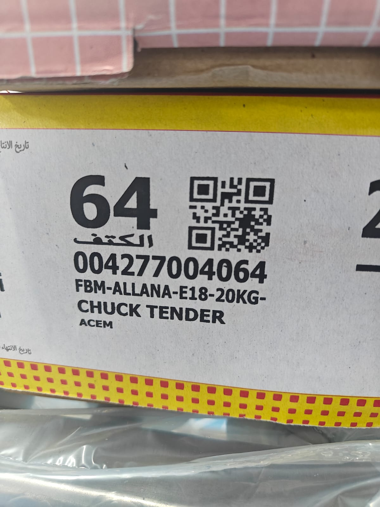
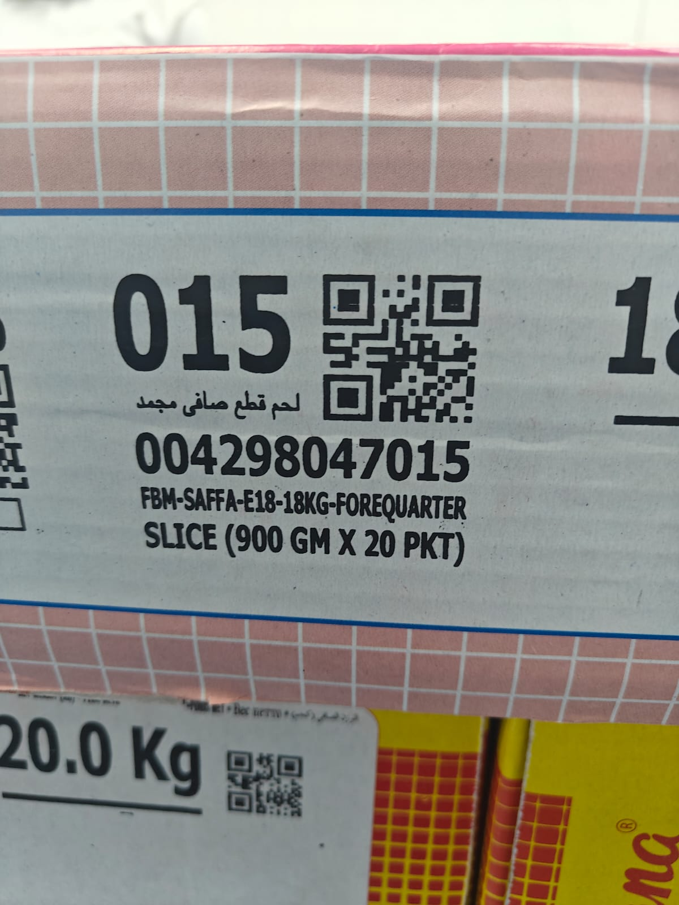
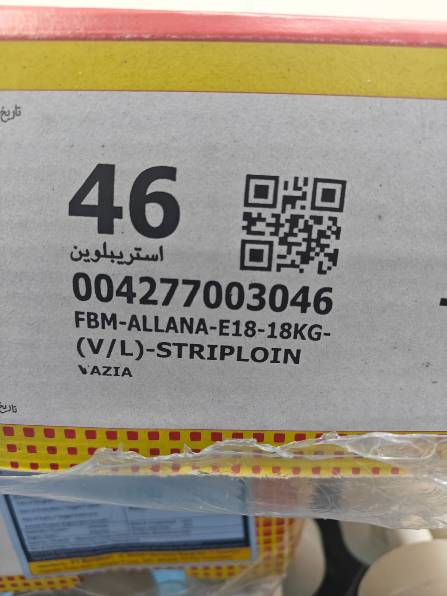

# Real-Time FMCG Weight Validation System

## Overview
A real-time quality assurance and product validation system developed for an FMCG meat processing workflow.

The system scans QR codes using a webcam, validates product weights against predefined tolerance ranges, and automatically accepts or rejects products while maintaining product traceability and analytics.

---

## Live Demo

🔗 [https://fmcg-weight-validator.streamlit.app/](https://fmcg-weight-validator.streamlit.app/)

## Features

- QR code product lookup
- Weight validation with tolerance checks
- Scan history tracking
- Product-level analytics
- CSV and Excel export

## Sample QR Codes

### QR Code 1


### QR Code 2


### QR Code 3

---

## Tech Stack

- Python
- Streamlit
- OpenCV
- Pandas
- SQLite
- Data Visualization

---

## Project Structure

```bash
app.py
scanner.py
requirements.txt
products.csv
static/
```

---

## How to Run

```bash
pip install -r requirements.txt
streamlit run app.py
```

---

## Future Improvements

- Cloud database integration
- Multi-camera support
- Production deployment
- Advanced analytics dashboard
- ERP integration


